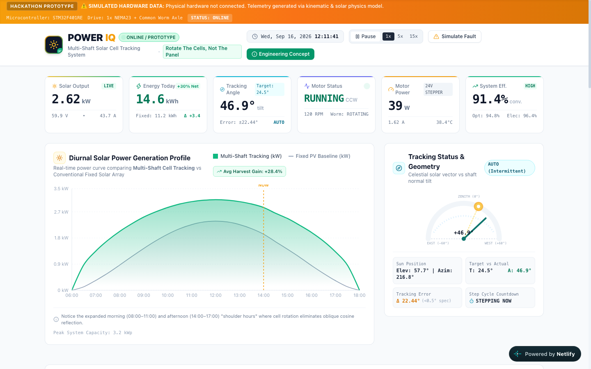
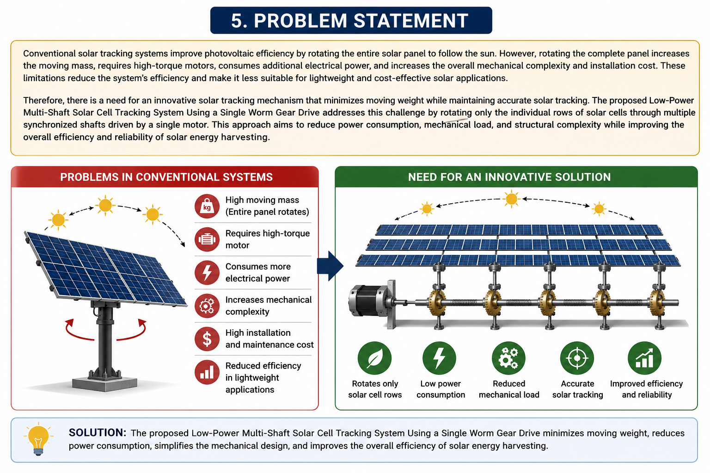
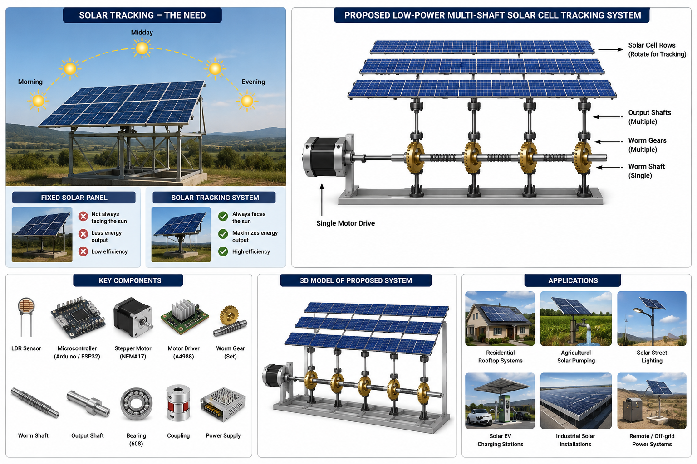
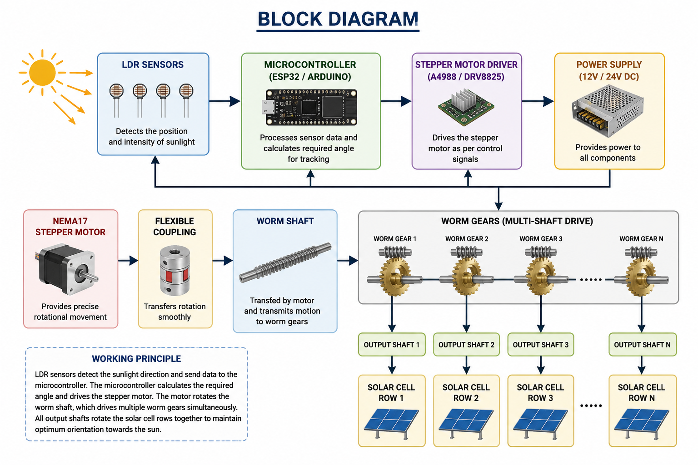
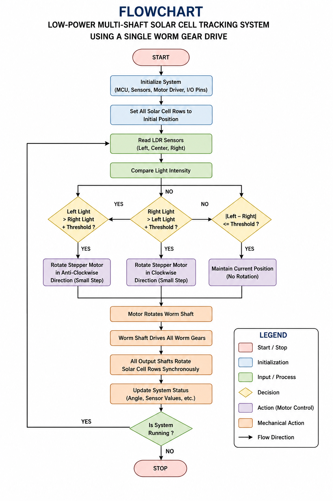
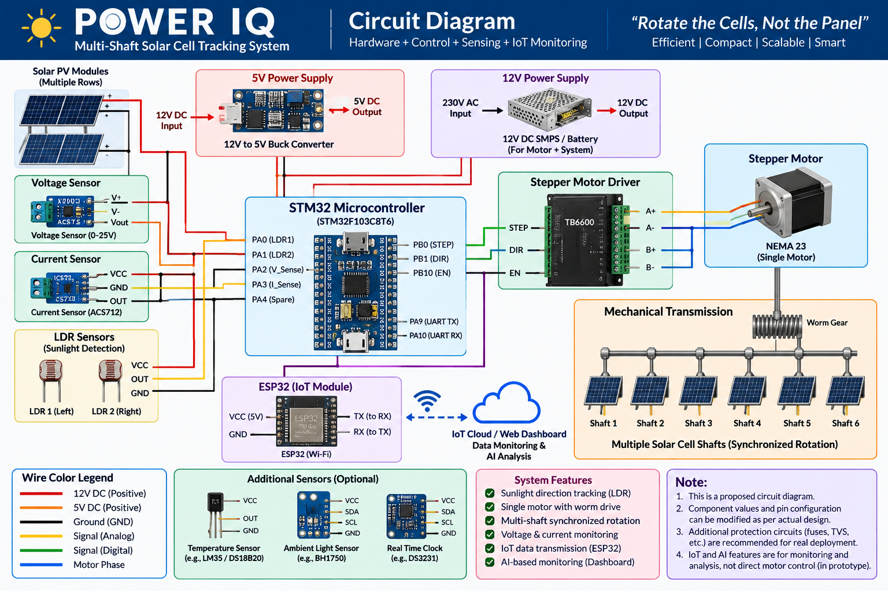
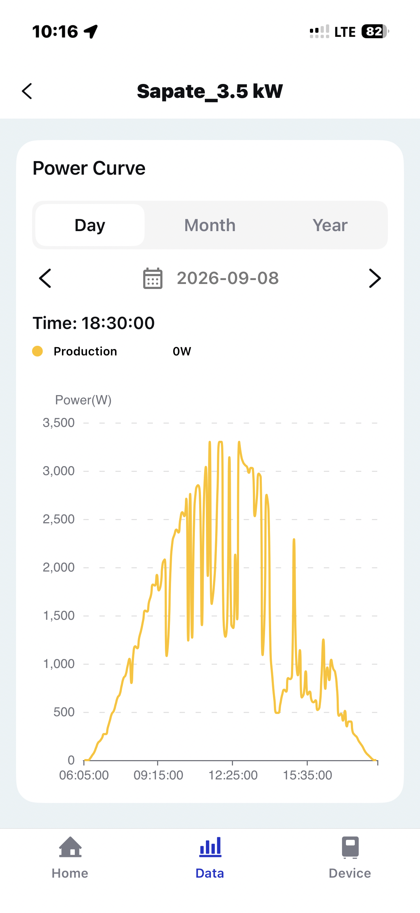
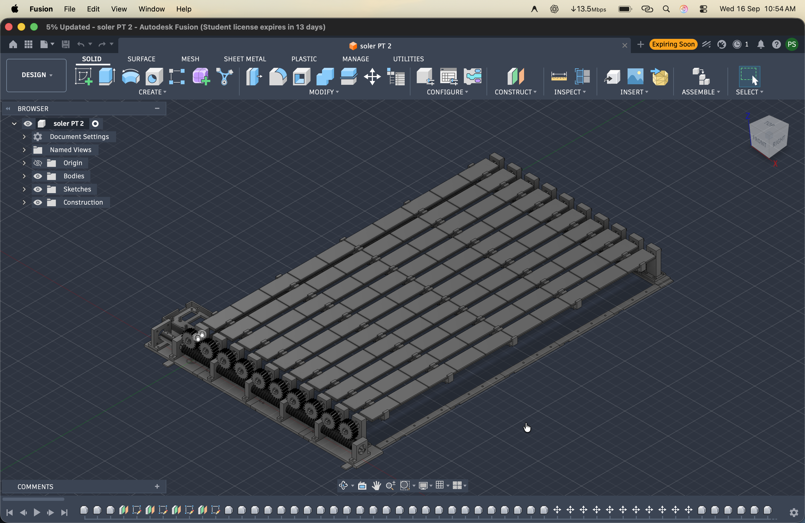

# POWER IQ – Multi-Shaft Solar Cell Tracking System

> **“ROTATE THE CELLS, NOT THE PANEL.”**  
> *A low-power solar tracking system utilizing a single stepper motor coupled to a common worm-gear transmission to rotate multiple parallel solar PV cell rows simultaneously.*

---

## Live Prototype Dashboard
🌐 **Live Deployment:** [https://multi-shaft-solar-cell-tracking-syste.netlify.app/](https://multi-shaft-solar-cell-tracking-syste.netlify.app/)

[](https://multi-shaft-solar-cell-tracking-syste.netlify.app/)

---

## 1. Project Overview

**POWER IQ** is a hardware, mechanical, embedded control, and IoT monitoring innovation prototype designed for renewable energy systems. Conventional solar trackers rotate heavy, entire panel structures using bulky linear actuators or multiple motors. In contrast, **POWER IQ** rotates only individual rows of solar PV cells mounted on lightweight parallel shafts, while the supporting chassis remains stationary.

This repository contains the complete engineering documentation, 3D CAD models, circuit diagrams, hardware prototype evidence, AI predictive maintenance simulation scripts, and the source code for the interactive IoT dashboard prototype.

---

## 2. Problem Being Addressed

Photovoltaic (PV) systems generate maximum electrical energy when sunlight strikes the cells perpendicular to their surface. However, because the sun’s angle changes continuously throughout the day, fixed solar panels suffer from substantial cosine reflection losses during morning and late afternoon hours.

Conventional solar tracking systems attempt to solve this by rotating the complete solar panel structure. This introduces severe engineering limitations:
1. **Excessive Moving Structural Mass:** Rotating large glass panels and steel frames requires heavy reinforcement, high structural weight, and bulky pivot bearings.
2. **High Motor Count and Actuator Cost:** Tracking multiple rows typically requires multiple independent motors, complex link linkages, or multi-axis slewing drives.
3. **Severe Wind Load Sensitivity:** Large planar panel surfaces act as sails, exerting destructive aerodynamic twisting moments on gears and foundations during high wind conditions.
4. **High Parasitic Power Consumption:** Continuous actuator operation can consume a noticeable fraction of the additional solar energy harvested, reducing the net system yield.



---

## 3. Proposed Solution

The **POWER IQ Multi-Shaft Solar Cell Tracking System** fundamentally alters the mechanical tracking dynamic:
- **Stationary Structural Frame:** The heavy support chassis remains firmly stationary, providing structural rigidity and resistance to outdoor wind exposure.
- **Rotating Solar-Cell Rows:** Individual strings/rows of PV cells are mounted on parallel rotating shafts.
- **Single Master Drive:** One NEMA 17 stepper motor drives a central continuous worm shaft.
- **Synchronous Worm Wheels:** Each PV cell shaft is driven by an anti-backlash worm wheel meshed to the central axle, ensuring identical angular rotation across all shafts.
- **Intermittent Tracking Algorithm:** The motor moves in small micro-steps only every few minutes, reducing parasitic motor energy to less than 1% of harvested energy.



---

## 4. Key Innovation

> **"ROTATE THE CELLS, NOT THE PANEL."**

1. **One Motor Drives Multiple Shafts:** A single stepper motor operates 8 parallel solar-cell shafts via a continuous worm gear axle, eliminating 7 motors compared to conventional multi-drive designs.
2. **Intrinsic Self-Locking Transmission:** Worm gearing cannot be back-driven by external forces. Wind shear on the cell slats cannot rotate the motor shaft, completely eliminating continuous motor holding current.
3. **Over 60% Reduction in Moving Mass:** Moving only lightweight cell-mounting slats instead of heavy glass panel frames dramatically reduces mechanical inertia.
4. **Flexible Torsion Service Loops:** Fatigue-rated flexible cables routed with generous bend radii allow continuous angular rotation without cable fatigue or twisting.

---

## 5. System Architecture

The project consists of two integrated operational pipelines:
1. **Physical Sensing & Closed-Loop Actuation Pipeline**
2. **IoT Telemetry & AI Predictive Maintenance Pipeline**

```
PHYSICAL ACTUATION PIPELINE:
Sunlight
   ↓
4-Quadrant LDR Sensors (Optical Differential Detection)
   ↓
STM32 / ESP32 Controller (Angular Correction Logic)
   ↓
Stepper Motor Driver (A4988 / TMC2209 — 16x Microstepping)
   ↓
Single NEMA 17 Stepper Motor
   ↓
Continuous Central Worm Shaft
   ↓
8x Synchronous Worm Wheels (40:1 Reduction Ratio)
   ↓
Multiple Parallel PV Cell Shafts
   ↓
Synchronized Solar Cell Row Rotation (+30% Energy Capture)
```

```
TELEMETRY & AI ANALYTICS PIPELINE:
Voltage & Current Sensors (INA219 / ACS712) + Angle Encoders
   ↓
Microcontroller ADC & I2C Data Acquisition
   ↓
IoT Telemetry Gateway (WiFi / MQTT)
   ↓
POWER IQ Live Web Dashboard
   ↓
AI Predictive Maintenance & Fault Detection Analysis
```



---

## 6. Working Principle

1. **Light Intensity Sensing:** An array of 4-quadrant Light Dependent Resistors (LDRs) separated by a shadow partition detects sunlight direction. When the sun moves, a voltage differential is generated across the sensor bridge.
2. **Angular Error Calculation:** The microcontroller reads the sensor voltages via its ADC and calculates the required angular correction angle ($\Delta\theta$).
3. **Intermittent Micro-Stepping:** If $\Delta\theta$ exceeds the tracking deadband ($>0.5^\circ$), the controller commands the stepper driver to advance by the required microsteps, then immediately powers down the driver coils into low-power standby.
4. **Synchronous Motion Transmission:** The stepper motor rotates the continuous central worm shaft. The worm threads engage with 8 identical worm wheel gears mounted on each parallel shaft, rotating all cell rows simultaneously.
5. **Self-Locking Hold:** Once the motor stops, the high friction angle of the 40:1 worm gearing locks the shafts in place against gravity and wind forces without drawing electrical power.
6. **Telemetry & Supervision:** Voltage and current sensors monitor instantaneous power ($P = V \times I$), verifying that the net energy gain exceeds motor consumption.



---

## 7. Hardware Architecture

### Mechanical System Components:
- **Parallel Rotating Shafts:** 8 precision $8\text{ mm}$ shafts supporting rows of solar cells.
- **Continuous Worm Drive Shaft:** Central steel worm screw transmitting motion to all shafts simultaneously.
- **Worm Gears (40:1 Reduction):** High gear ratio provides fine angular positioning resolution and high output torque.
- **Bearings:** 16x 608ZZ miniature radial ball bearings providing smooth, low-friction shaft rotation.
- **Chassis & Brackets:** Modular 3D-printed structural frame modeled in Autodesk Fusion 360 and printed in durable PETG.
- **Flexible Wiring Harness:** Service loops designed to withstand repeated angular cycling without copper conductor fatigue.

### Electronics & Sensors:
- **Microcontroller:** STM32F401RE / ESP32 NodeMCU.
- **Actuator:** NEMA 17 Bipolar Stepper Motor ($1.8^\circ/\text{step}$, $1.5\text{ A}$ phase current).
- **Driver:** TMC2209 / A4988 with 1/16 microstepping ($3,200\text{ microsteps/revolution}$).
- **Optical Sensors:** 4-quadrant Cadmium Sulfide (CdS) LDR sensor array.
- **Power Monitoring:** INA219 high-side DC sensor ($I^2C$) measuring solar string voltage and current.
- **Motor Load Sensor:** ACS712-05B current sensor measuring motor drive current.

---

## 8. AI Architecture & Predictive Maintenance

The project includes an **AI-Based Predictive Analysis & Maintenance** layer designed to monitor system telemetry and detect mechanical degradation before physical failure occurs.

> **Prototype Status:**  
> The AI functionality in this prototype is implemented as an algorithmic anomaly detection engine. It evaluates telemetry parameters and validates diagnostic thresholds for future edge TinyML integration on the STM32 microcontroller.

### Monitored Anomaly Vectors:
1. **Motor Current Signature ($I_{\text{motor}}$):** Monitors active drive current against baseline profiles. Spikes ($>2.0\text{ A}$) indicate mechanical binding, bearing friction, or gear misalignment.
2. **Shaft Synchronization Variance ($\Delta\theta$):** Compares angular encoder feedback across all 8 shafts. Deviations ($>0.35^\circ$) flag gear backlash slippage or coupling wear.
3. **Gear Backlash Estimation:** Monitors torsional play between the worm screw and worm wheels ($<0.04^\circ$ nominal).
4. **Thermal Accumulation:** Tracks motor coil temperature ($<55^\circ\text{C}$ safe threshold).

Interactive simulation scripts and sample datasets are available in [`ai/`](ai/).

---

## 9. Software & Technology Stack

- **Embedded Firmware:** Embedded C / C++, Arduino IDE / STM32CubeIDE, AccelStepper Library.
- **Web Dashboard:** React 19, TypeScript, Vite.
- **Styling & UI:** Tailwind CSS, Lucide Icons.
- **Data Visualization:** Recharts (responsive area charts and comparative bar graphs).
- **AI & Data Analysis:** Python 3 (NumPy, JSON telemetry processing).
- **CAD & Mechanical Design:** Autodesk Fusion 360, FDM Slicers (PrusaSlicer / Cura).
- **Hosting & Deployment:** Netlify (Static SPA hosting with continuous deployment).

---

## 10. Dashboard Features

The web dashboard provides real-time supervisory IoT monitoring and simulation capabilities:

1. **Top Header & Status Badges:** Displays `ONLINE / PROTOTYPE`, `SIMULATED HARDWARE DATA`, live date/time clock, and simulation speed controls (`1x`, `5x`, `15x`).
2. **Main KPI Cards:** Displays Solar Power (2.84 kW), Daily Energy (14.6 kWh), Tracking Angle (47°), Motor Status (RUNNING), Motor Power (38 W), and System Efficiency (91.4%).
3. **Diurnal Solar Generation Chart:** Recharts Area chart comparing Multi-Shaft Tracking PV against a fixed-tilt panel baseline from 06:00 to 18:00.
4. **Celestial Tracking Dial:** SVG celestial sky-dome gauge showing sun position vector, shaft normal angle, and real-time tracking error.
5. **Multi-Shaft Mechanical Visualizer:** 8-row visual schematic showing the central worm drive and synchronous cell-slat tilt animations.
6. **Motor & Transmission Health:** Telemetry monitors for motor RPM, drive current, bus voltage, winding temperature, and mechanical load factor.
7. **AI Predictive Maintenance Panel:** AI health index (96%), component risk matrix, and natural-language diagnostic insight box. Includes a **"Simulate Fault"** toggle for evaluator demonstration.
8. **Interactive Control Simulation:** Manual jog controls ($\pm 5^\circ$, $\pm 1^\circ$), Home stow ($0^\circ$), and Emergency Stop.
9. **Energy Analytics & Net Gain Comparison:** Daily, weekly, and monthly net gain metrics demonstrating:
   $$\text{Net Energy Gain} = \text{Harvest Gain} - E_{\text{motor}}$$
10. **System Architecture Visualizer:** Dual diagrams displaying physical actuation and IoT data pipelines.
11. **Alerts & Diagnostics Feed:** Real-time event log tracking operational status.

---

## 11. CAD & Mechanical Model

All 3D CAD modeling was conducted in **Autodesk Fusion 360**. Production-ready STL files are located in [`hardware/cad_model/stl_parts/`](hardware/cad_model/stl_parts/).

| CAD Model Overview | Shaft & Gear Detail |
| :---: | :---: |
|  |  |

Detailed CAD specifications and print parameters are documented in [`hardware/cad_model/README.md`](hardware/cad_model/README.md).

---

## 12. Circuit Diagram

The circuit schematic integrates the STM32/ESP32 controller, TMC2209/A4988 stepper driver, LDR optical array, and power measurement sensors.

[](hardware/circuit_diagram/)

Detailed circuit wiring and pinout tables are documented in [`hardware/circuit_diagram/README.md`](hardware/circuit_diagram/README.md).

---

## 13. Physical Prototype Evidence

A working physical hardware prototype has been fabricated using 3D-printed PETG transmission components, miniature ball bearings, and a central worm drive shaft.

| Assembled Prototype Front View | Mechanism Detail |
| :---: | :---: |
|  |  |

Additional detail photographs and mechanical specifications are in [`hardware/prototype_images/README.md`](hardware/prototype_images/README.md).

---

## 14. Project Documentation

Comprehensive technical documents and competition slide decks are included in [`documentation/`](documentation/):

- **Project Synopsis (Markdown):** [`documentation/synopsis/SYNOPSIS.md`](documentation/synopsis/SYNOPSIS.md)
- **Project Synopsis (Word Document):** [`documentation/synopsis/Synopsis_Multi_Shaft_Solar_Cell_Tracking_System.docx`](documentation/synopsis/Synopsis_Multi_Shaft_Solar_Cell_Tracking_System.docx)
- **Project Synopsis (PDF Document):** [`documentation/synopsis/Synopsis_Multi_Shaft_Solar_Cell_Tracking_System.pdf`](documentation/synopsis/Synopsis_Multi_Shaft_Solar_Cell_Tracking_System.pdf)
- **Presentation Slide Deck (PowerPoint):** [`documentation/project_presentation/Power_IQ_Presentation.pptx`](documentation/project_presentation/Power_IQ_Presentation.pptx)
- **Presentation Slide Deck (PDF):** [`documentation/project_presentation/Power_IQ_Presentation.pdf`](documentation/project_presentation/Power_IQ_Presentation.pdf)

---

## 15. Repository Directory Structure

```
Power-IQ-Multi-Shaft-Solar-Cell-Tracking-System/
├── README.md                                # Master project documentation
├── netlify.toml                             # Netlify deployment configuration
├── .gitignore                               # Git ignore rules
│
├── dashboard/                               # Frontend IoT prototype dashboard
│   ├── src/                                 # React + TypeScript source code
│   │   ├── components/                      # UI components (KPIs, Charts, Dial, Shafts)
│   │   ├── hooks/                           # Kinematic & telemetry simulation hook
│   │   ├── types/                           # TypeScript interfaces
│   │   └── utils/                           # Solar math & diurnal curve formulas
│   ├── public/                              # Static public assets & favicons
│   ├── package.json                         # Node.js dependencies
│   ├── vite.config.ts                       # Vite build configuration
│   └── README.md                            # Dashboard setup instructions
│
├── firmware/                                # Physical prototype embedded firmware
│   ├── arduino_stepper_control/             # Arduino UNO + L298N + NEMA 17 sketch
│   │   └── arduino_stepper_control.ino
│   └── README.md                            # Pinout table, transmission ratio & serial commands
│
├── ai/                                      # AI & Predictive Maintenance layer
│   ├── prototype_analysis/                  # Python anomaly detection simulation
│   │   └── predictive_maintenance_simulation.py
│   ├── sample_data/                         # Multi-cycle sample telemetry dataset
│   │   └── sample_telemetry_stream.json
│   └── README.md                            # AI architecture documentation
│
├── hardware/                                # Hardware engineering files
│   ├── circuit_diagram/                     # Circuit schematic and pinout documentation
│   │   ├── circuit_diagram.png
│   │   └── README.md
│   ├── prototype_images/                    # Photographs of assembled prototype
│   │   ├── prototype_assembled_front.png
│   │   ├── mechanism_view_1.png ... mechanism_view_4.png
│   │   └── README.md
│   └── cad_model/                           # 3D CAD renders and manufacturing files
│       ├── cad_model_isometric_render.png
│       ├── cad_model_shaft_detail.png
│       ├── cad_model_full_assembly.jpg
│       ├── stl_parts/                       # 3D printable STL files
│       └── README.md
│
├── documentation/                           # Academic & competition documents
│   ├── synopsis/                            # Project synopsis (DOCX, PDF, Markdown)
│   │   ├── Synopsis_Multi_Shaft_Solar_Cell_Tracking_System.docx
│   │   ├── Synopsis_Multi_Shaft_Solar_Cell_Tracking_System.pdf
│   │   └── SYNOPSIS.md
│   └── project_presentation/                # Slide decks (PPTX, PDF)
│       ├── Power_IQ_Presentation.pptx
│       ├── Power_IQ_Presentation.pdf
│       └── README.md
│
└── assets/                                  # Visual assets and diagrams used in README
    ├── dashboard_preview.png
    ├── block_diagram.png
    ├── system_flowchart.png
    ├── problem_conventional_system.png
    └── solar_tracking_principle.png
```

---

## 16. Future Scope

1. **Hardware-in-the-Loop Validation:** Direct bi-directional WebSocket / MQTT link connecting physical STM32 microcontroller hardware to the cloud dashboard.
2. **On-Device TinyML Anomaly Detection:** Deploying a quantized neural network or decision forest directly onto the STM32 MCU to perform vibration FFT and current signature analysis on the edge.
3. **Bifacial PV Cell Slat Integration:** Leveraging ground-albedo reflection beneath the open multi-shaft slat chassis to boost energy harvesting by an additional 8–15%.
4. **Dedicated Micro-Inverters:** Equipping individual shafts with micro-inverters for per-row Maximum Power Point Tracking (MPPT) under partial cloud shading.

---

## 17. Project Status

- **Mechanical Prototype:** Functional 3D-printed prototype assembled with worm drive and parallel shafts.
- **Embedded Control Concept:** Intermittent tracking control logic designed for STM32 / ESP32.
- **IoT Dashboard Prototype:** Fully functional, interactive web dashboard deployed live on Netlify.
- **AI Predictive Maintenance:** Algorithmic simulation prototype validated on sample telemetry streams.

---

## 18. Project Team

- **Prathamesh Sapate** — *Group Leader*
- **Shreyash Arun Pachade**
- **Vansh Dobhale**
- **Prachi Ronge**

---

## How to Run Locally

### 1. Dashboard (React + Vite)
```bash
cd dashboard
npm install
npm run dev
```
Open `http://localhost:5173` in your browser.

### 2. AI Predictive Maintenance Simulation (Python)
```bash
python3 ai/prototype_analysis/predictive_maintenance_simulation.py
```
