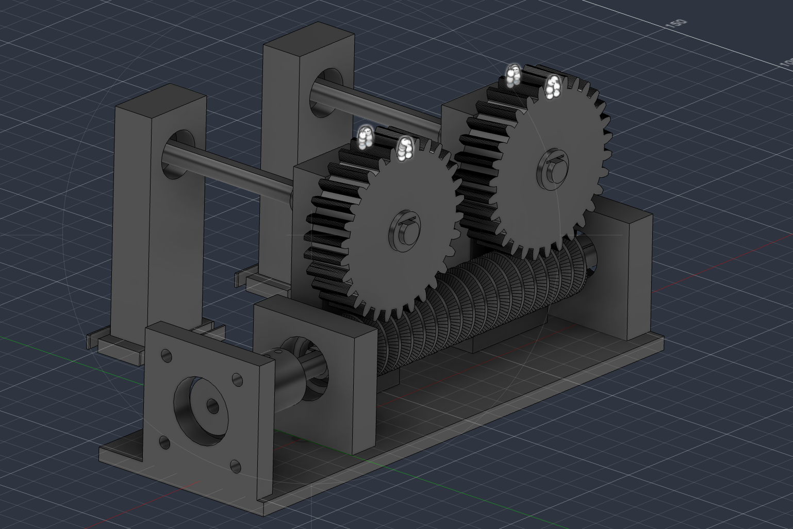
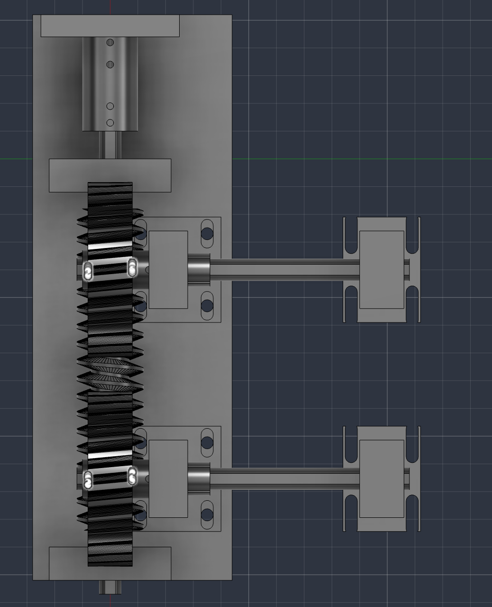
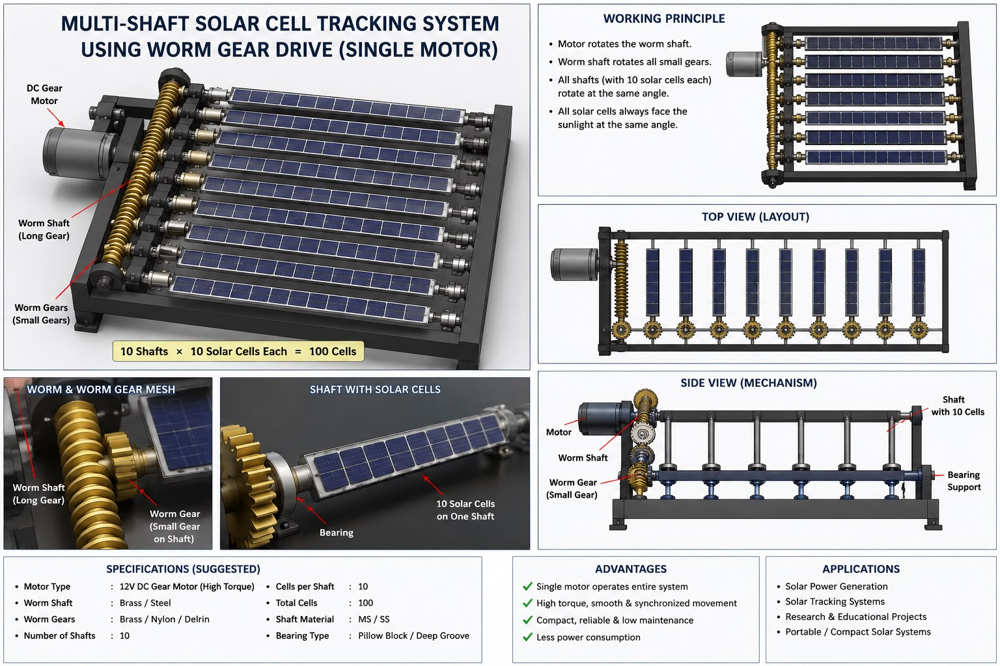

# 3D CAD Models & Manufacturing Files

## Overview

The entire mechanical architecture of the **POWER IQ Multi-Shaft Solar Cell Tracking System** was engineered in **Autodesk Fusion 360**. All components were designed for rapid prototyping and fabrication using additive manufacturing (3D printing).

---

## CAD Renders

### 1. Isometric Assembly Render

*Figure 1: Full 3D CAD assembly in Autodesk Fusion 360 showcasing the stationary frame and synchronized parallel cell-slat shafts.*

### 2. Drive Train & Shaft Detail

*Figure 2: Section view illustrating the worm screw meshing with the worm wheel gear mounted on the PV cell shaft.*

### 3. Full System Exploded / Detail Assembly

*Figure 3: Comprehensive mechanical assembly including motor bracket, bearing pillow blocks, and rail guides.*

---

## 3D Printable STL Files

The production-ready STL files are provided in [`stl_parts/`](./stl_parts/):

| File Name | Part Description | Quantity | Recommended Infill |
| :--- | :--- | :---: | :---: |
| `A_worm_1_x1.stl` | Single-start drive worm screw | 1 | 80% (High rigidity) |
| `A_wheel_01_x10.stl` | 40-tooth worm wheel gear | 8 | 60% |
| `A_motormount_x1.stl` | NEMA 17 motor mounting bracket | 1 | 50% |
| `A_coupling_x1.stl` | Flexible motor-to-worm shaft coupler | 1 | 100% |
| `PRINT_shaftseg_START_x10.stl` | Initial shaft bearing retainer block | 8 | 40% |
| `PRINT_shaftseg_MID_x40.stl` | Intermediate PV slat pivot clip | 16 | 40% |
| `PRINT_shaftseg_END_x10.stl` | Terminal shaft pillow block | 8 | 40% |
| `A_frail_1_x1.stl` ... `A_frail_4_x1.stl` | Structural chassis side rails | 4 | 45% |
| `A_wjblk_1_x4.stl` | Worm bearing pillow block | 4 | 60% |

### Recommended 3D Printing Parameters:
- **Filament Material:** PETG or Tough PLA (PETG recommended for outdoor UV and thermal stability)
- **Nozzle Temperature:** $235^\circ\text{C}$ (PETG) / $210^\circ\text{C}$ (PLA)
- **Bed Temperature:** $75^\circ\text{C}$ (PETG) / $60^\circ\text{C}$ (PLA)
- **Layer Height:** $0.16\text{ mm} - 0.20\text{ mm}$
- **Perimeters / Walls:** 4 walls for gear teeth and shaft mounts
