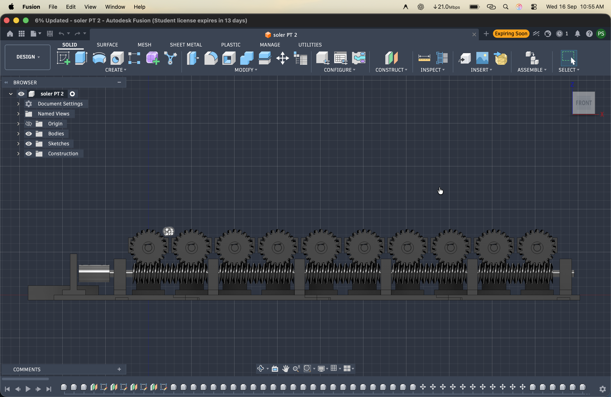
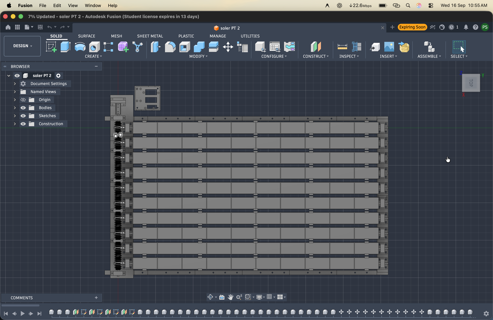
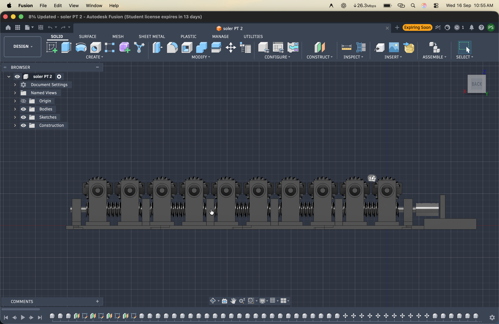

# Physical Hardware Prototype Gallery

This directory contains photographs of the assembled **POWER IQ** physical hardware prototype and detailed mechanical sub-assemblies.

---

## 1. Assembled Prototype (Front & Elevation View)

*Figure: Fully assembled Multi-Shaft Solar Cell Tracking System prototype showing 3D-printed chassis, stepper motor mount, central worm drive axle, and parallel PV cell slat rows.*

---

## 2. Mechanical Detail Views

The mechanical drive train utilizes precision 3D-printed transmission elements to achieve high torque and synchronous shaft rotation.

| View | Component Detail | Image |
| :--- | :--- | :--- |
| **Mechanism View 1** | Worm gear meshing & 40:1 reduction wheel on individual shaft |  |
| **Mechanism View 2** | Central transmission axle & bearing support block |  |
| **Mechanism View 3** | Motor coupling & flexible mounting frame |  |
| **Mechanism View 4** | Parallel PV cell slats in tilted tracking alignment |  |

---

## Mechanical Specifications

- **Chassis Dimensions:** $420\text{ mm} \times 280\text{ mm} \times 95\text{ mm}$
- **Number of Parallel Shafts:** 8 shafts (expandable modular design)
- **Shaft Diameter:** $8\text{ mm}$ hardened precision steel rod
- **Bearings:** 16x 608ZZ high-precision miniature radial ball bearings
- **Gear Reduction Ratio:** $40:1$ (single-start worm screw driving 40-tooth worm wheel)
- **Back-drive Lock:** Self-locking worm angle prevents wind-induced back-driving.
- **Material:** FDM 3D-printed in PETG/PLA with 40% gyroid infill for high torsional rigidity.
